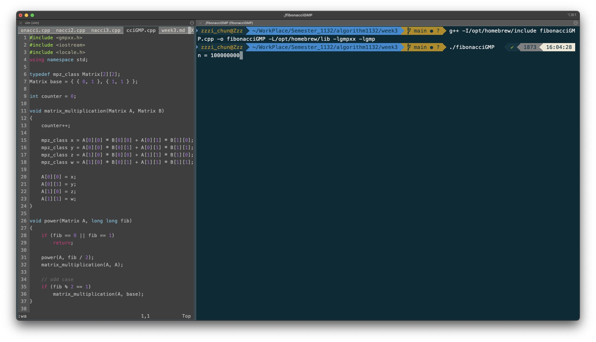
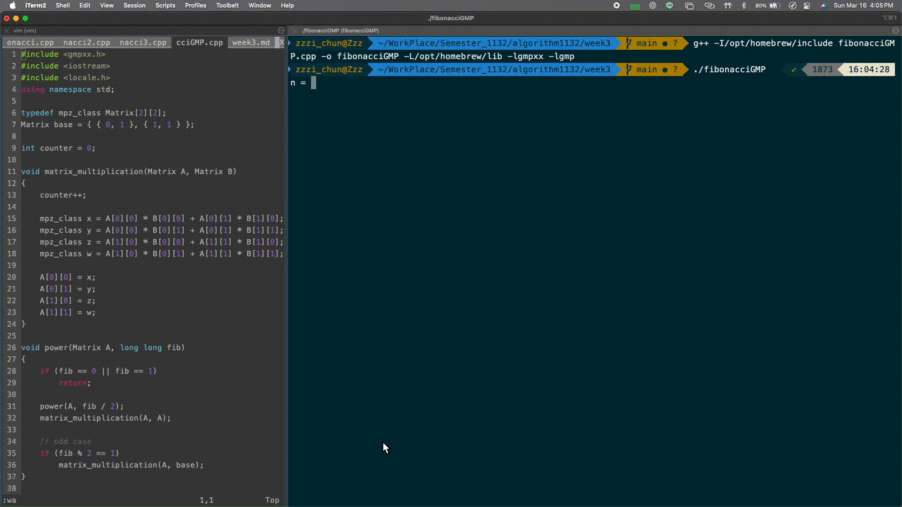

# Fibonacci Number

以下三段程式的 fibonacci number 都宣告為 `unsigned long long` 型態, 並且使用 `<local.h>` 函式庫中的 `setlocale` 函數, 讓輸出數字加上逗號分隔以方便閱讀.

## <font color="#449df9"> **方法一 : Recursive Approach** </font>

**code :**

```cpp
#include <iostream>
#include <locale.h>
using namespace std;

int counter = 0;

// recursive
unsigned long long fibonacci(int n)
{
    counter++;
    if (n <= 1) {
        return n;
    } else
        return fibonacci(n - 1) + fibonacci(n - 2);
}

int main()
{
    // 設定 locale 為當地區設置, default is America.
    setlocale(LC_NUMERIC, "");

    printf("using recursive approach\n");
    printf("n = ");

    int n;
    cin >> n;

    printf("F(%d) = %'llu\n", n, fibonacci(n));
    printf("run times = %'d\n", counter);

    return 0;
}
```

**Output :**


- 時間複雜度爲 `O(2^n)`
  每次呼叫遞迴時, 會進行兩次子問題的計算, 造成大量重複計算.
- 空間複雜度爲 `O(n)`
  空間複雜度 n 爲遞迴呼叫堆疊的深度.

<span style="color:green;">優點:</span>

1.  寫法簡潔直觀, 容易理解.
2.  易於實現, 尤其對於小的 n 值.

<span style="color:red;">缺點:</span>

1.  效率低, 因為有大量重複的計算.
2.  不適合處理大範圍的數字.

## <font color="#449df9"> **方法二 : Iterative Approach** </font>

**code :**

```cpp
#include <iostream>
#include <locale.h>
using namespace std;

int counter = 0;

// iterative
unsigned long long fibonacci2(int n)
{
    if (n <= 1) {
        counter++;
        return n;
    }

    unsigned long long previous = 0, current = 1;
    for (int i = 2; i <= n; i++) {
        counter++;
        unsigned long long next = (previous + current);
        previous = current;
        current = next;
    }
    return current;
}

int main()
{
    // 設定 locale 為當地區設置, default is America.
    setlocale(LC_NUMERIC, "");

    printf("using iterative approach\n");
    printf("n = ");

    int n;
    cin >> n;

    printf("F(%d) = %'llu\n", n, fibonacci2(n));
    printf("run times = %'d\n", counter);

    return 0;
}
```

**Output :**


- 時間複雜度爲 `O(n)`
  每次僅計算前兩項數字, 避免了遞迴的重複計算.
- 空間複雜度爲 `O(1)`
  只需要常數空間來保存當前計算過的數字, 因此空間複雜度是常數.

<span style="color:green;">優點:</span>

1. 計算效率高, 適用於較大的 n.
2. 空間使用非常節省, 只需少量變數.

<span style="color:red;">缺點:</span>

1. 寫法稍微複雜一些, 不如遞迴直觀.

## <font color="#449df9"> **方法三 : Matrix Exponentiation** </font>

**code :**

```cpp
#include <iostream>
#include <locale.h>
using namespace std;

typedef unsigned long long Matrix[2][2];
Matrix base = { { 0, 1 }, { 1, 1 } };

int counter = 0;

void matrix_multiplication(Matrix a, Matrix b)
{
    counter++;
    Matrix result = { 0 };
    for (int i = 0; i < 2; i++) {
        for (int j = 0; j < 2; j++) {
            for (int k = 0; k < 2; k++) {
                result[i][j] += (a[i][k] * b[k][j]);
            }
        }
    }

    // copy to a
    for (int i = 0; i < 2; i++) {
        for (int j = 0; j < 2; j++) {
            a[i][j] = result[i][j];
        }
    }
}

void power(Matrix A, int fib)
{
    if (fib == 0 || fib == 1)
        return;

    power(A, fib / 2);
    matrix_multiplication(A, A);

    // odd case
    if (fib % 2 == 1)
        matrix_multiplication(A, base);
}

// matrix exponentiation
unsigned long long fibonacci3(int n)
{
    if (n <= 1) {
        counter++;
        return n;
    }

    Matrix A = { { 0, 1 }, { 1, 1 } };
    power(A, n);

    return A[0][1];
}

int main()
{
    // 設定 locale 為當地區設置, default is America.
    setlocale(LC_NUMERIC, "");

    printf("using matrix exponentiation approach\n");
    printf("n = ");

    int n;
    cin >> n;

    printf("F(%d) = %'llu\n", n, fibonacci3(n));
    printf("run times (do matrix_multiplication) = %'d\n", counter);

    return 0;
}
```

**Output :**


- 時間複雜度爲 `O(log n)`
  利用矩陣的快速幂算法, 每次把問題的規模縮小一半, 快速算 Fibonacci 數列.
- 空間複雜度爲 `O(1)`
  除了矩陣外, 只需要少量額外空間, 空間複雜度為常數.

<span style="color:green;">優點:</span>

1. 計算速度極快, 對於非常大的 n 特別高效.
2. 空間非常節省, 適合大範圍的數字計算.

<span style="color:red;">缺點:</span>

1. 實現上較為複雜, 需要理解矩陣運算與快速幂算法.
2. 當 n 很小時, 過度使用矩陣運算可能反而不夠高效.

## <font color="#449df9"> **Extra** </font>

### unsigned long long 的限制

由於 `unsigned long long` 的範圍僅為 18,446,744,073,709,551,615

爲了求得 maximal of n 我們可以使用近似公式估算費氏數列的值可以用黃金比例公式來近似：

$$
F(n) \approx \frac{\varphi^n}{\sqrt{5}}
$$

其中：

$$
\varphi = \frac{1 + \sqrt{5}}{2} \approx 1.618
$$

令：

$$
\frac{\varphi^n}{\sqrt{5}} \leq 2^{64} - 1
$$

取對數：

$$
n \log_2(\varphi) \leq \log_2\left( (2^{64} - 1) \times \sqrt{5} \right)
$$

已知：

$$
\log_2(\varphi) \approx 0.694
$$

$$
\log_2(5) \approx 1.161 / 2 = 0.581
$$

$$
\log_2(2^{64} - 1) \approx 64
$$

所以：

$$
n \times 0.694 \leq 64 + 0.581
$$

解得：

$$
n \leq \frac{64.581}{0.694} \approx 93.1
$$

因此，最大整數 $n$ 為 93。

**實際測試 :**


在 n ≥ 94 時, 因為輸出超過了 `unsigned long long` 的範圍, 程式確實開始顯示錯誤.

---

### GMP (GNU Multiple Precision Library) 函式庫

GMP（GNU Multiple Precision Arithmetic Library）是一個用於大數運算的開源函式庫, 支援任意精度的整數、有理數與浮點數計算.

**根據 GMP 官方網站的描述**

> _"There is no practical limit to the precision except the ones implied by the available memory in the machine GMP runs on."
> (實際上，GMP 的精度沒有固定上限，唯一的限制是系統可用的記憶體。)_

從這點可以知道, 使用 GMP 宣告的變數並不像 `int` 或 `double` 這樣有固定大小, 而是可以根據需求動態調整精度, 只要記憶體足夠, 就能處理極大的數值.

**code :**

```cpp
#include <gmpxx.h>
#include <iostream>
#include <locale.h>
using namespace std;

typedef mpz_class Matrix[2][2];
Matrix base = { { 0, 1 }, { 1, 1 } };

int counter = 0;

void matrix_multiplication(Matrix A, Matrix B)
{
    counter++;

    mpz_class x = A[0][0] * B[0][0] + A[0][1] * B[1][0];
    mpz_class y = A[0][0] * B[0][1] + A[0][1] * B[1][1];
    mpz_class z = A[1][0] * B[0][0] + A[1][1] * B[1][0];
    mpz_class w = A[1][0] * B[0][1] + A[1][1] * B[1][1];

    A[0][0] = x;
    A[0][1] = y;
    A[1][0] = z;
    A[1][1] = w;
}

void power(Matrix A, long long fib)
{
    if (fib == 0 || fib == 1)
        return;

    power(A, fib / 2);
    matrix_multiplication(A, A);

    // odd case
    if (fib % 2 == 1)
        matrix_multiplication(A, base);
}

mpz_class fibonacciGMP(long long n)
{
    if (n == 0) {
        counter++;
        return 0;
    }
    if (n == 1) {
        counter++;
        return 1;
    }

    Matrix A = { { 0, 1 }, { 1, 1 } };
    power(A, n);

    return A[0][1];
}

int main()
{
    // 設定 locale 為當地區設置, default is America.
    setlocale(LC_NUMERIC, "");
    cout.imbue(locale(""));

    long long n;
    cout << "n = ";
    cin >> n;

    mpz_class result = fibonacciGMP(n);
    cout << "F(" << n << ") = " << result << endl;
    printf("run times (do matrix_multiplication) = %d\n", counter);

    // Calculate and display the number of digits in the result
    size_t digits = result.get_str().size();
    printf("Number of digits in F(%'lld) = %'zu\n", n, digits);

    return 0;
}
```

在這段程式碼中, 我對 `matrix_multiplication` 進行了優化, 使用變數直接計算矩陣乘法結果, 而不是使用迴圈來進行矩陣運算, 提高運算效率.
此外, 在計算完 Fibonacci 數值後, 我使用 `get_str()` 將結果轉換為字串, 並透過字串的長度來計算 fibonacci 數的位數.

**Output :**


**F(100,000,000) :**



